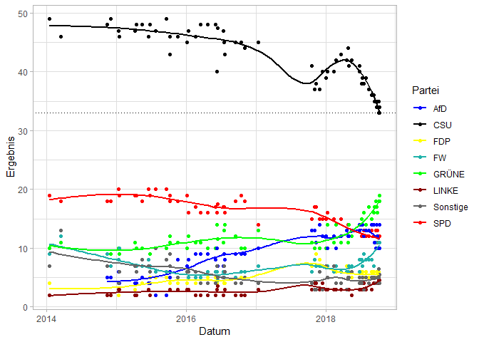
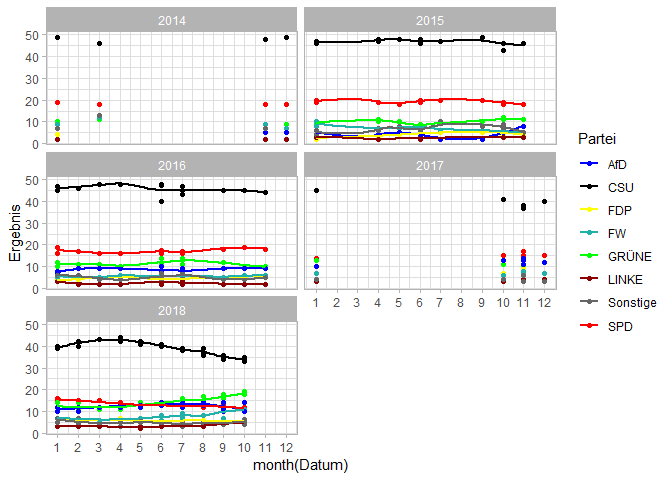
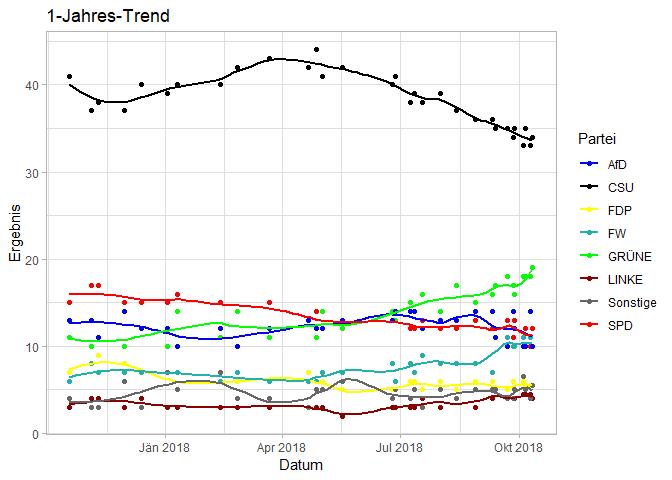
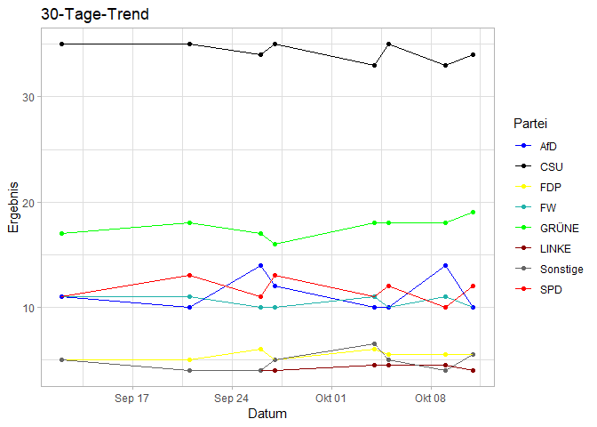
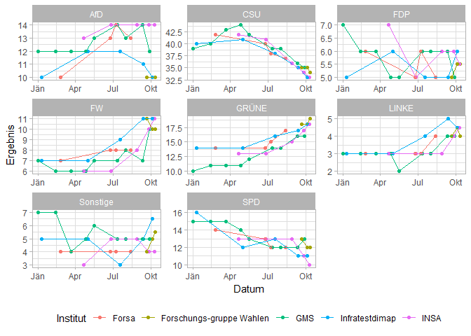
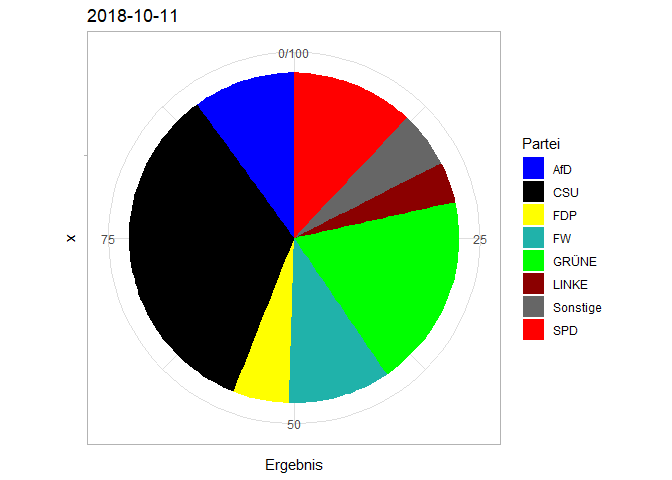

Umfrage-Daten aller repräsentativer Umfragen für die Landtagswahl in Bayern, entnommen von [wahlrecht.de](https://www.wahlrecht.de/umfragen/landtage/bayern.htm)

<!-- --><!-- -->

## 1-Jahres-Trend

<!-- -->

### Entwicklung innerhalb der letzten 30 Tage

<!-- -->

## Gibt es Unterschiede hinsichtlich der Auftraggeber?

<!-- -->

Bei der CSU und den Grünen scheinen sich die Institute einig zu sein. Allerdings gibt es bei anderen Parteien ziemliche Unterschiede:

* die AfD schneidet bei INSA-Umfragen konsequent besser ab als bei z.B. FGW-Umfragen oder InfraTest. Der Unterschied ist im Vergleich mit anderen Parteien extrem: 14% vs. 10% sind überraschend, wenn man die Stichprobengrößen betrachtet. Vielleicht gibt es hier systematische Unterschiede bei der Stichprobenziehung?
* bei der FDP gibt es ebenfalls Unterschiede, allerdings sehen diese weniger systematisch aus. Außerdem sind die Schwankungen mit einem Prozentpunkt vernachlässigbar.

## Alle mögen Pie-Charts

<!-- -->
